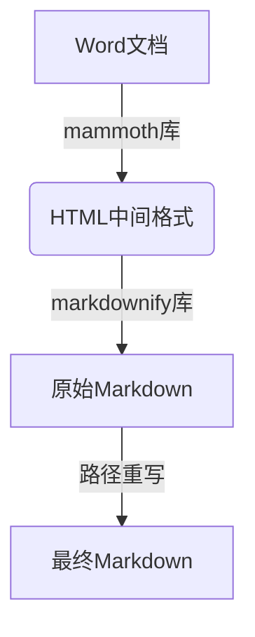

# TOMarkdown

一个~~高效~~将 Word 文档（`.doc`/`.docx`）批量转换为 Markdown 格式的工具，支持图片、表格等非文本内容的保留，并提供~~灵活~~的配置选项。


## 最新版本 

- ✨ **新增**：
  1. 批量转化时可选择转化文件保存方式
  2. 在config中追加，不保存html文件（过度文件可以默认不保存）
  3. 不独立使用文件夹（选项使转化后的md文件统一在同一目录下，这种方式使各md文件同时使用一个media文件夹）
  4. 强命名（uuid的扩展，可选18，32，64位等强化随机命名，进一步防止冲突）
- 🐛 **修复**：无 [查看完整更新日志 →](https://github.com/TKNSHSN/ToMarkDown/releases)


## ✨ 功能特性

- **批量转换**  
  支持选择文件夹或批量选择文件，自动遍历处理所有 Word 文档。
- **~~完整~~保留非文本内容**  
  图片、表格等非文本内容保存到 自定义（默认`media` ）文件夹，并在 Markdown 中使用**相对路径**引用。
- **性能优化**  
  - 每次处理 **3~5 个文件**，避免资源占用过高。
  - ~~自动释放内存~~，希望运行稳定。
- **配置化管理**  
  通过 `.config.json` 自定义输出路径、并发数量等参数。

## 📦 安装依赖

### 必需依赖库
```bash
# 核心转换库
pip install mammoth.py markdownify

# 文件操作支持库（如果未预装）
pip install pathlib futures
```

## 🚀 使用说明

### 命令行模式

```
# 转换单个文件
python main.py input.docx

# 转换整个文件夹
python main.py /path/to/word/files
```

### 示例输出结构

```
output/
├── example.md
├── example.html
└── media/
    ├── image1.png
    └── image1.png
```

## ⚙️ 配置说明

编辑 `.config.json` ：

```
{
  "output_dir": "output",
  "media_subdir": "media",
  "default_formats": ["docx"],
  "concurrent_limit": 4,
  "save_html": true,
  "uuid_length": 32,
  "independent_folders": true
}
```


## 🛠️ 实现原理

### 转换流程



1. **Word → HTML**
   使用 `mammoth` 解析 Word 文档并生成 HTML。
2. **HTML → Markdown**
   使用 `markdownify` 将 HTML 转换为 Markdown，并提取图片/表格到 `media` 文件夹。
3. **路径优化**
   自动替换绝对路径为相对路径，确保 Markdown 可移植性。

### 关键技术点

1. **媒体资源处理**
   - 使用`uuid`生成唯一文件名
   - 图片/表格保存到`media`目录
   - 自动替换为相对路径（``）
2. **批量处理机制**
3. **配置文件**


## 📌 注意事项

- 若 Word 中使用复杂排版（如嵌套表格），建议手动检查转换结果。
- 需安装 `mammoth` 的 Python 版本（非 Node.js 版本）。

## 🤝 贡献与协议


---

### 效果预览


---

